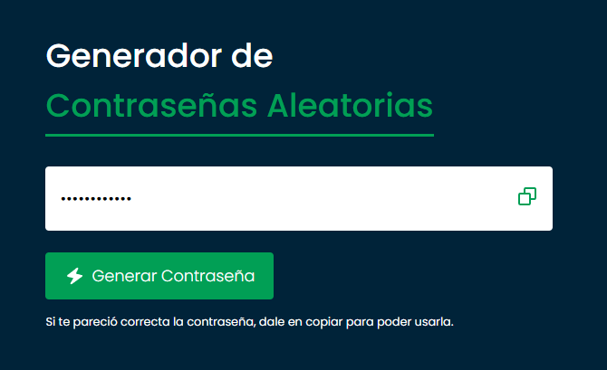

# Generador de Contraseñas Aleatorias

Este proyecto es una aplicación web que genera contraseñas aleatorias y permite copiarlas al portapapeles. La aplicación utiliza HTML, CSS y JavaScript para crear una interfaz de usuario atractiva y funcional.

## Características

- Generación de contraseñas aleatorias con letras mayúsculas, minúsculas, números y símbolos.
- Visualización de la contraseña generada en un campo de texto.
- Copia de la contraseña generada al portapapeles con un solo clic.
- Mensajes de confirmación y animaciones para mejorar la experiencia del usuario.

## Tecnologías Utilizadas

- HTML
- CSS
- JavaScript

# Pasos Seguidos

## Estructura HTML:

- Se creó una estructura básica de HTML con un contenedor principal `.container` que incluye un campo de entrada para la contraseña, un botón para generar la contraseña y un icono para copiar la contraseña.

## Estilos CSS:

- Se aplicaron estilos generales para el cuerpo y el contenedor.
- Se definieron estilos específicos para el campo de entrada, el botón y el icono de copiar.
- Se utilizaron animaciones CSS para mostrar mensajes de confirmación y cambiar el icono de copiar.

## Lógica JavaScript:

- Se definió la lógica para generar contraseñas aleatorias utilizando caracteres alfanuméricos y símbolos.
- Se implementó la funcionalidad para copiar la contraseña generada al portapapeles.
- Se añadieron mensajes de confirmación y cambios de icono para mejorar la experiencia del usuario.
